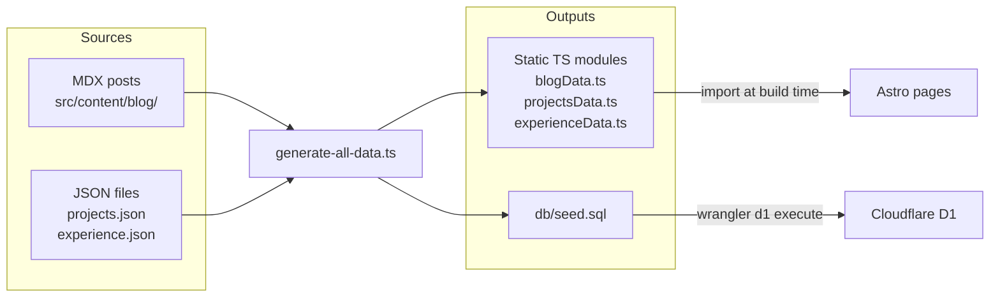
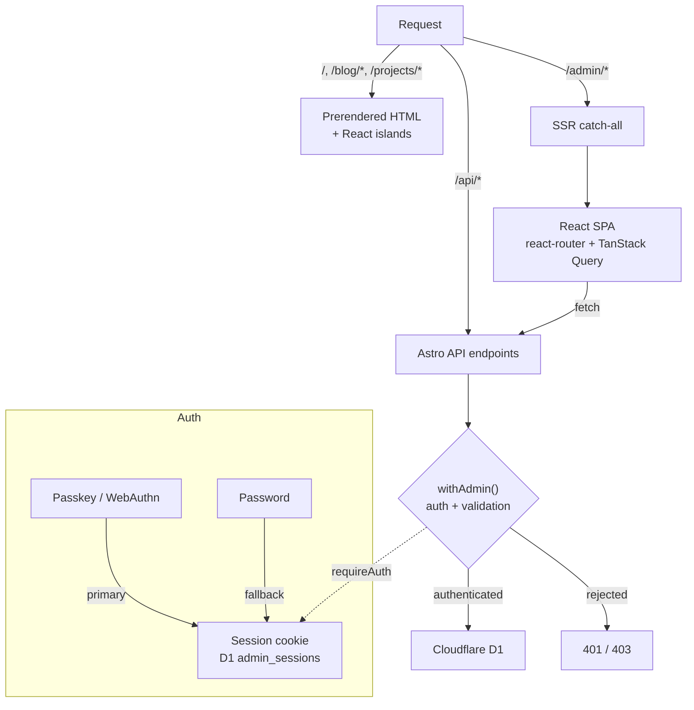
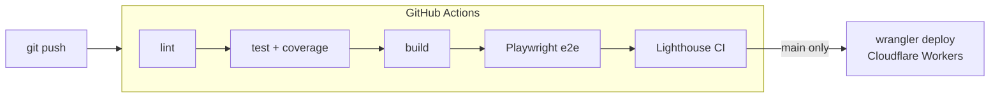

# po4yka.dev

Personal site, blog, and apps portfolio. Astro 6 with React islands for the public side, a full React SPA behind passkey auth for the admin, all running on Cloudflare Workers + D1.

## Architecture

Public pages are prerendered at build time. React only hydrates where interactivity is needed via `client:load` or `client:visible` directives -- the bundle stays small and the public site has no runtime server.

Content lives in two canonical forms: MDX files for blog posts, JSON for projects and experience. A build step runs `scripts/generate-all-data.ts` before every Astro build, which produces static TypeScript modules for the frontend and `db/seed.sql` for D1. Editing content means editing source files, not generated output.

The admin panel at `/admin/*` is an SSR catch-all that mounts a React Router + TanStack Query SPA. All mutations go through `withAdmin()`, a route wrapper that handles auth, CSRF, and Zod validation in one place. Auth is passkey-first via WebAuthn, with a password fallback controlled by an env flag.

### Content pipeline



### Request flow



### CI/CD



## Development

```sh
cp .env.example .env
npm install
npm run dev
```

The dev server proxies Cloudflare bindings via `platformProxy`. For the admin panel you also need a local D1 database:

```sh
wrangler d1 execute blog-db --local --file=db/schema.sql
wrangler d1 execute blog-db --local --file=db/seed.sql
```

If you add or edit content files, regenerate the data pipeline outputs before building:

```sh
npm run generate:all
```

## Deployment

Pushes to `main` trigger CI (lint, tests, build, e2e, Lighthouse) and then deploy via `wrangler deploy` using the Astro-generated `dist/server/wrangler.json`. Required GitHub secrets: `CLOUDFLARE_API_TOKEN`, `CLOUDFLARE_ACCOUNT_ID`. The `ADMIN_PASSWORD` env var is set in the Cloudflare Workers dashboard.

## License

[MIT](LICENSE)
