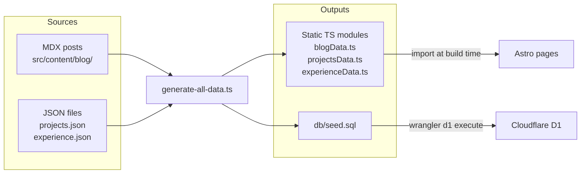
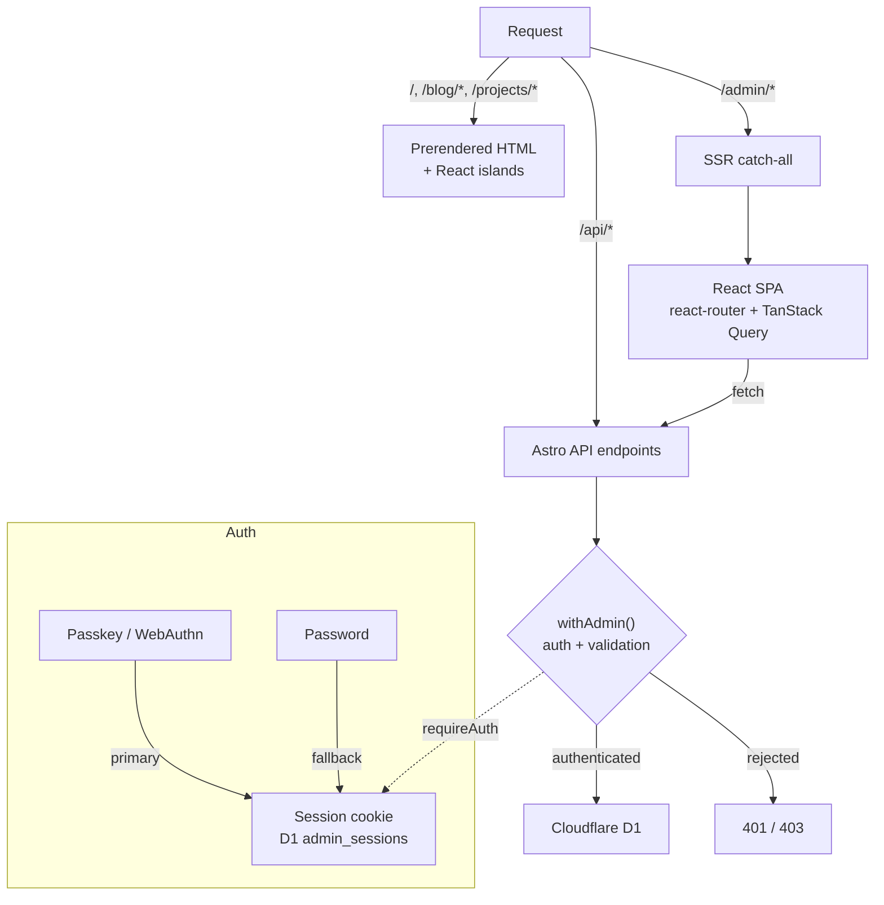
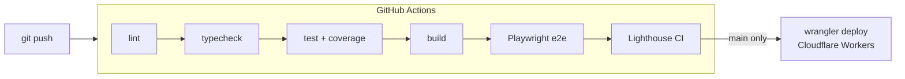

# po4yka.dev

Personal site, blog, and apps portfolio for a mobile engineer. Built with Astro 6, React 19, TypeScript 6, and Tailwind CSS 4. React islands for the public side, a full React SPA behind passkey auth for the admin, all running on Cloudflare Workers + D1.

**Stack:** Astro 6 | React 19 | TypeScript 6 | Tailwind CSS 4 | Motion | Zustand | TanStack Query | Cloudflare Workers + D1 | WebAuthn

## Architecture

Public pages are prerendered at build time. React only hydrates where interactivity is needed via `client:load` or `client:visible` directives -- the bundle stays small and the public site has no runtime server.

Content lives in two canonical forms: MDX files for blog posts, JSON for projects and experience. A build step runs `scripts/generate-all-data.ts` before every Astro build, which produces static TypeScript modules for the frontend and `db/seed.sql` for D1. Editing content means editing source files, not generated output.

The admin panel at `/admin/*` is an SSR catch-all that mounts a React Router + TanStack Query SPA. All mutations go through `withAdmin()`, a route wrapper that handles auth, CSRF, capability scoping, and Zod validation in one place. Entity CRUD is driven by `defineCollection()` -- a factory that derives DB operations, Zod schemas, and API route handlers from a single field-level definition. Auth is passkey-first via WebAuthn, with a password fallback controlled by an env flag.

### Content pipeline



### Request flow



### CI/CD



## Design

Terminal workstation aesthetic -- the site looks and feels like a well-configured Ghostty terminal, not a startup landing page. Catppuccin Mocha palette for dark mode, soft lavender editorial surface for light. Single muted purple accent (`#9184f7` dark / `#6b5ce6` light). JetBrains Mono as the primary font, Inter for blog prose.

Custom terminal component kit: MacWindow, BootBlock, Cmd, OutputBlock, PanelShell, InfoTable. Atmospheric decorations fetch real data from GitHub APIs (activity sparkline, language distribution, latest release). See `DESIGN.md` for the full visual specification and `docs/Guidelines.md` for quality rules.

## Development

```sh
cp .env.example .env
npm install
npm run dev
```

The dev server proxies Cloudflare bindings via `platformProxy`. For the admin panel you also need a local D1 database:

```sh
wrangler d1 execute blog-db --local --file=db/schema.sql
wrangler d1 execute blog-db --local --file=db/seed.sql
```

### Scripts

| Command | Purpose |
|---------|---------|
| `npm run dev` | Start dev server |
| `npm run build` | Generate data + Astro build |
| `npm run lint` | ESLint |
| `npm run typecheck` | TypeScript check |
| `npm test` | Unit tests (Vitest) |
| `npm run test:e2e` | E2E tests (Playwright) |
| `npm run test:coverage` | Unit tests with coverage report |
| `npm run generate:all` | Regenerate all data files from sources |
| `npm run generate:blog` | Regenerate blog data only |
| `npm run validate:all` | Check source/DB sync |
| `npm run setup:passkey` | Generate passkey setup token |

### Adding content

Edit source files, then regenerate:

```sh
# Blog post: create MDX in src/content/blog/en/
npm run generate:blog

# Projects or experience: edit src/content/projects.json or experience.json
npm run generate:all
```

## Articles

| # | Title | Tags | Date |
|---|-------|------|------|
| 1 | [RAG breaks earlier than people think](/src/content/blog/en/rag-breaks-earlier-than-people-think.mdx) | RAG, LLM, Knowledge Management, Architecture | Apr 2026 |

## Testing

175 unit tests (Vitest) + 20 E2E tests (Playwright). Coverage thresholds: 70% lines/functions, 55% branches.

Tested areas: auth utilities (CSRF, rate limiting, session cookies), WebAuthn credential lifecycle, admin CRUD for all entities, Zod validation schemas, blog stats aggregation, GitHub API caching/fallback, and public page rendering.

```sh
npm test                # unit tests
npm run test:coverage   # with coverage report
npm run test:e2e        # Playwright (requires dev server)
```

## Deployment

Pushes to `main` trigger CI (lint, typecheck, tests + coverage, build, Playwright e2e, Lighthouse) and then deploy via `wrangler deploy`. Required GitHub secrets: `CLOUDFLARE_API_TOKEN`, `CLOUDFLARE_ACCOUNT_ID`. The `ADMIN_PASSWORD` env var is set in the Cloudflare Workers dashboard.

## License

[MIT](LICENSE)
